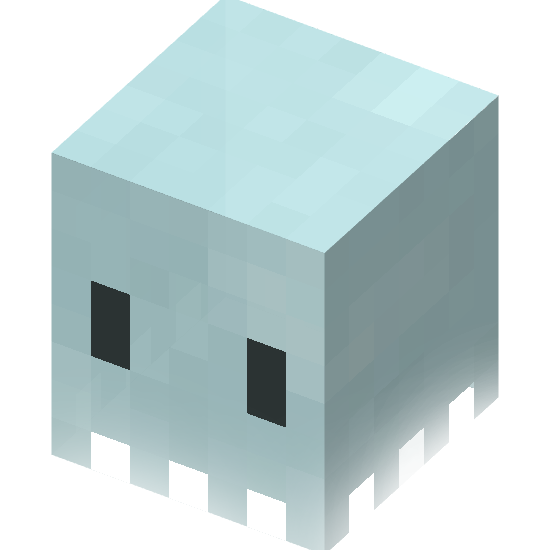

 Spectre

> Spectre is a Minecraft plugin that allows the player to control the visibility of nearby players.

## Features
- Toggle the visibility of nearby players
- Change the visibility mode
- Change the visibility of armor
- Change the visibility distance

## Commands
| Command | Description | Permission |
| --- | --- | --- |
| `/spectre help` | Display the help message | `spectre.help` |
| `/spectre reload` | Reload the configuration | `spectre.reload` |
| `/spectre <enable\|disable>` | Toggle the visibility of nearby players | `spectre.toggle` |
| `/spectre mode <vanish\|ghost\|invisible>` | Change the visibility mode | `spectre.mode.<vanish\|ghost\|invisible>` |
| `/spectre armor <visible\|hidden\|boots>` | Change the visibility of armor | `spectre.armor.<visible\|hidden\|boots>` |
| `/spectre distance <distance>` | Change the visibility distance | `spectre.set_distance` |

## Permissions
| Permission | Description |
| --- | --- |
| `spectre.help` | Access to the help command |
| `spectre.reload` | Access to the reload command |
| `spectre.toggle` | Access to the toggle command |
| `spectre.mode.<vanish\|ghost\|invisible>` | Access to the mode command |
| `spectre.armor.<visible\|hidden\|boots>` | Access to the armor command |
| `spectre.set_distance` | Access to the distance command |
| `spectre.bypass` | Bypass the visibility restrictions, player with this permission will always be visible |

## Configuration

All messages can be customized in the `config.yml` file. On the BOOTS mode players with no boots will be rendered with boots specified in the configuration.
